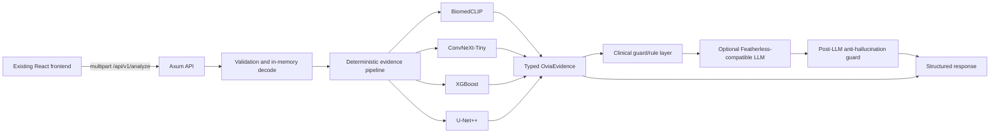
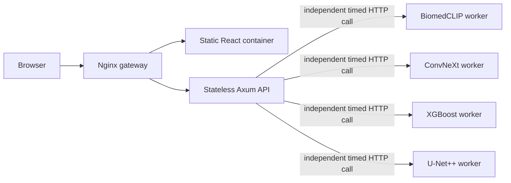
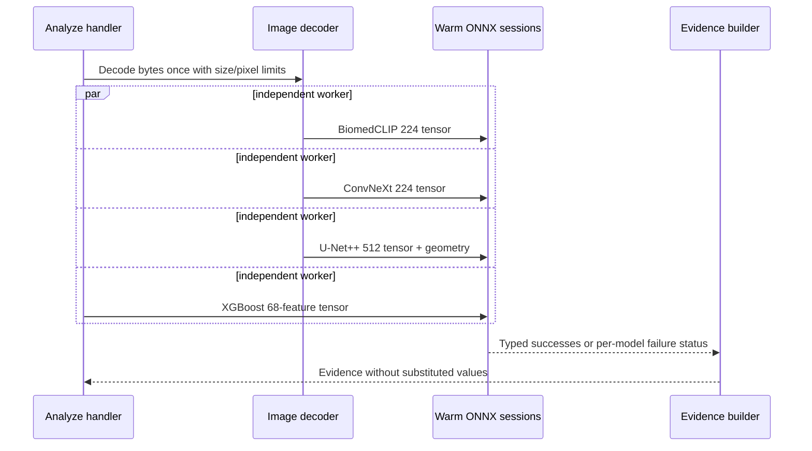
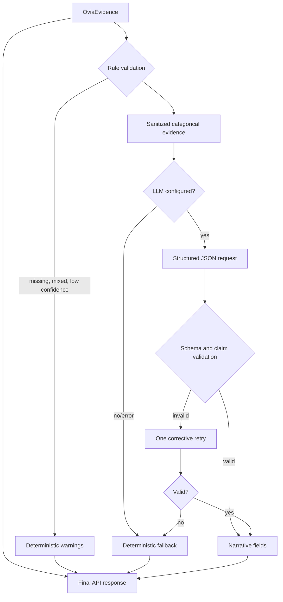
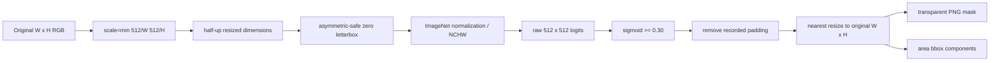
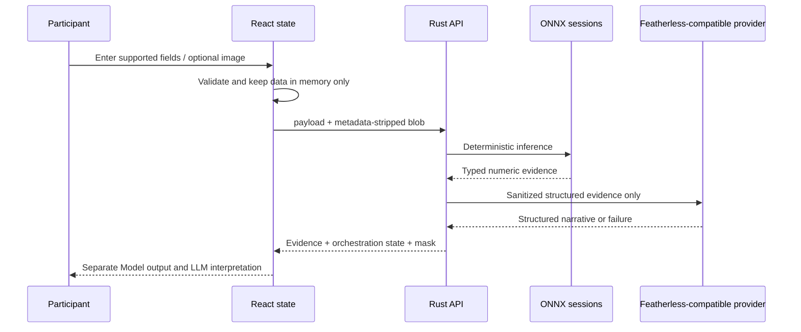

# Architecture

## System

Rust is authoritative. No image is sent to the LLM. Numeric evidence is serialized from ONNX/postprocessing fields, never from generated prose.

## Production container topology

Only the gateway publishes a host port. The API and frontend share the edge network; the API and model workers share a separate internal network. The API container has no ONNX mount, and every worker mounts only its own artifact plus shared immutable metadata. Local mode retains the in-process registry for development and parity tests.

## Inference flow

In local mode, sessions are protected individually because ONNX Runtime session execution is not generally safe through concurrent mutable calls. In production, process/container isolation is the primary boundary. Independent request deadlines turn an unreachable or stuck worker into one model-specific `inference_error`; evidence from responsive workers is still returned. The recorded CPU benchmark found ONNX internal-thread contention made sequential inference faster, so container CPU limits remain hardware-tunable.

## Evidence orchestration

## U-Net++ geometry

The returned mask has the original native dimensions. The frontend puts the original image and mask in the same `object-contain` coordinate box, and the normalized bounding rectangle uses the same original dimensions. Portrait, wide, narrow, and the locked 959×537 inverse fixture share this path.

## Frontend lifecycle

